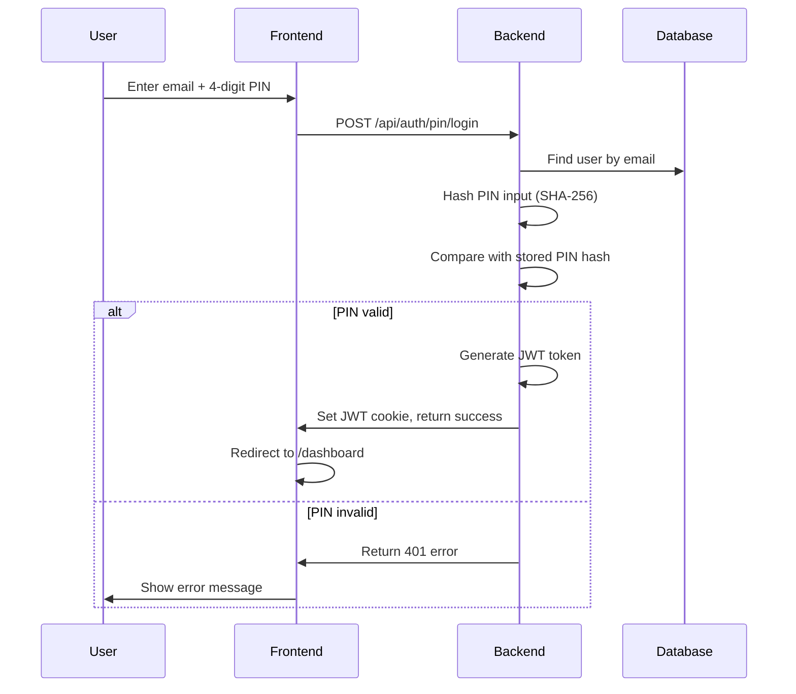
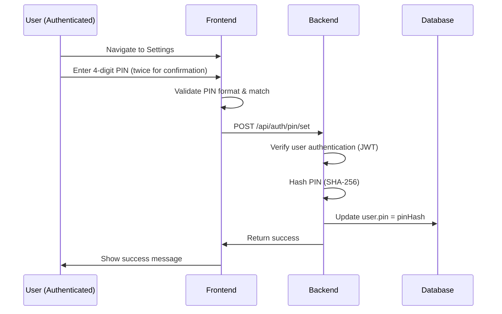

# PIN Authentication Guide: Quick Login with 4-Digit PIN

This guide provides a comprehensive walkthrough for implementing PIN-based authentication in a Next.js application. It covers a quick login flow using a 4-digit PIN, database schema, backend API routes, token management, and frontend implementation. This PIN authentication works alongside the passwordless magic link authentication as a faster login option for returning users on trusted devices.

## Table of Contents

1. [Overview & Authentication Flow](#1-overview--authentication-flow)
2. [Prerequisites & Environment Setup](#2-prerequisites--environment-setup)
3. [Database Schema](#3-database-schema)
4. [JWT Token Management](#4-jwt-token-management)
5. [Backend API Implementation](#5-backend-api-implementation)
6. [Frontend Implementation](#6-frontend-implementation)
7. [Error Handling](#7-error-handling)
8. [Security Best Practices](#8-security-best-practices)

---

## 1. Overview & Authentication Flow

This implementation provides a **quick PIN-based authentication** experience for returning users. Users can set up a 4-digit PIN after their first login (via magic link) for faster subsequent access on trusted devices.

### PIN Authentication Flow



### PIN Setup Flow



### Key Features

- **Quick Access**: Faster login with a 4-digit PIN vs waiting for email
- **Optional Security Layer**: Users choose whether to enable PIN login
- **SHA-256 Hashing**: PINs are never stored in plain text
- **Session Control**: Optional "Keep me signed in" for extended sessions
- **Fallback to Magic Link**: Users can always use magic link if they forget their PIN
- **Numeric Only**: Enforced 4-digit numeric PIN format

---

## 2. Prerequisites & Environment Setup

### Environment Variables

Ensure the following variables are set in your `.env` file:

```env
# Database
MONGODB_URI=mongodb+srv://...

# JWT Secret (REQUIRED)
ACCESS_TOKEN_SECRET=your-super-secret-jwt-key-at-least-32-characters
# Generate with: openssl rand -hex 32

# JWT Expiry (optional, defaults to 3h)
ACCESS_TOKEN_EXPIRY=3h

# Application URL
NEXT_PUBLIC_APP_URL=http://localhost:3000  # Production: https://yourdomain.com
```

> [!IMPORTANT]
> The `ACCESS_TOKEN_SECRET` is **CRITICAL** for security. The application will exit if this is not set. Generate a strong secret using:
>
> ```bash
> openssl rand -hex 32
> ```

### Dependencies

Install the required packages:

```bash
npm install mongoose jsonwebtoken crypto zod
```

**TypeScript Types:**

```bash
npm install -D @types/jsonwebtoken
```

---

## 3. Database Schema

We use MongoDB with Mongoose. The PIN authentication extends the User model with an additional optional `pin` field.

### User Model (`models/User.ts`)

The `pin` field stores the SHA-256 hash of the 4-digit PIN.

```typescript
import { Schema, model, models, Document, Model } from "mongoose";

export interface IUser {
  email: string;
  createdAt: Date;
  updatedAt: Date;

  preferences: {
    aiSummary: boolean;
    allowedSources: string[];
  };

  featureFlags?: {
    sidebarNavigation: boolean;
  };

  // Auth fields
  pin?: string; // Hashed PIN for quick login (SHA-256)

  // Chat History
  chatHistory?: {
    role: "user" | "assistant";
    content: string;
    createdAt: Date;
  }[];

  // Encrypted Credentials
  credentials?: {
    github?: string; // Encrypted
    groqApiKeys?: string[]; // Encrypted
  };
}

export interface UserDocument extends IUser, Document {}

const UserSchema = new Schema<UserDocument>(
  {
    email: { type: String, required: true, unique: true },

    // Preferences
    preferences: {
      aiSummary: { type: Boolean, default: false },
      allowedSources: { type: [String], default: [] },
    },

    featureFlags: {
      sidebarNavigation: { type: Boolean, default: false },
    },

    pin: { type: String }, // SHA-256 hashed PIN

    chatHistory: [
      {
        role: { type: String, enum: ["user", "assistant"], required: true },
        content: { type: String, required: true },
        createdAt: { type: Date, default: Date.now },
      },
    ],

    credentials: {
      github: { type: String }, // Encrypted
      groqApiKeys: { type: [String], default: [] }, // Encrypted
    },
  },
  {
    timestamps: true, // Auto-generates createdAt and updatedAt
  },
);

// Prevent overwrite on hot reload
const User =
  (models.User as Model<UserDocument>) ||
  model<UserDocument>("User", UserSchema);

export default User;
```

### Database Indexes

The `email` field is automatically indexed with `unique: true`.

---

## 4. JWT Token Management

### Auth Utility (`lib/auth.ts`)

Handles JWT signing, verification, and current user retrieval from cookies.

```typescript
import { logger } from "@untools/logger";
import * as jwt from "jsonwebtoken";
import type { JwtPayload, SignOptions } from "jsonwebtoken";
import { cookies } from "next/headers";

const ACCESS_SECRET = process.env.ACCESS_TOKEN_SECRET;

if (!ACCESS_SECRET) {
  console.error(
    "❌ CRITICAL: ACCESS_TOKEN_SECRET environment variable not set!",
  );
  console.error("   Set it in .env.local or your deployment platform");
  console.error("   Generate a strong secret: openssl rand -hex 32");
  process.exit(1);
}

const ACCESS_TOKEN_EXPIRY = process.env.ACCESS_TOKEN_EXPIRY || "3h";

export interface UserPayload extends JwtPayload {
  userId: string;
  email: string;
}

/**
 * Sign a JWT token with user payload
 * @param payload - User ID and email
 * @param expiresIn - Token expiration (default: from ACCESS_TOKEN_EXPIRY env var)
 */
export function signToken(
  payload: Omit<UserPayload, "iat" | "exp">,
  expiresIn?: string,
) {
  if (!ACCESS_SECRET) throw new Error("ACCESS_TOKEN_SECRET is missing");
  const options: SignOptions = {
    expiresIn: (expiresIn || ACCESS_TOKEN_EXPIRY) as SignOptions["expiresIn"],
  };
  return jwt.sign(payload, ACCESS_SECRET, options);
}

/**
 * Verify and decode a JWT token
 * @param token - The JWT token string
 * @returns Decoded payload or null if invalid
 */
export function verifyToken(token: string): UserPayload | null {
  if (!ACCESS_SECRET) return null;
  try {
    return jwt.verify(token, ACCESS_SECRET) as UserPayload;
  } catch (e) {
    logger.error("❌ Invalid token", e);
    return null;
  }
}

/**
 * Get current authenticated user from cookies (server-side)
 * @returns User payload or null if not authenticated
 */
export async function getCurrentUser() {
  const cookieStore = await cookies();
  const token = cookieStore.get("token")?.value;

  if (!token) return null;

  return verifyToken(token);
}

/**
 * Set the authentication cookie
 */
export async function setAuthCookie(token: string, maxAge: number) {
  const cookieStore = await cookies();
  cookieStore.set("token", token, {
    httpOnly: true,
    secure: process.env.NODE_ENV === "production",
    sameSite: "lax",
    path: "/",
    maxAge: maxAge, // seconds
  });
}

/**
 * Clear the authentication cookie
 */
export async function clearAuthCookie() {
  const cookieStore = await cookies();
  cookieStore.delete("token");
}
```

---

## 5. Backend API Implementation

### Database Connection (`lib/mongodb.ts`)

```typescript
import mongoose from "mongoose";

const MONGODB_URI = process.env.MONGODB_URI;

if (!MONGODB_URI) {
  throw new Error("Please define the MONGODB_URI environment variable");
}

interface MongooseCache {
  conn: typeof mongoose | null;
  promise: Promise<typeof mongoose> | null;
}

declare global {
  var mongoose: MongooseCache;
}

let cached = global.mongoose;

if (!cached) {
  cached = global.mongoose = { conn: null, promise: null };
}

async function connectToDatabase() {
  if (cached.conn) {
    return cached.conn;
  }

  if (!cached.promise) {
    const opts = {
      bufferCommands: false,
      maxPoolSize: 10,
    };

    cached.promise = mongoose.connect(MONGODB_URI!, opts);
  }

  try {
    cached.conn = await cached.promise;
  } catch (e) {
    cached.promise = null;
    throw e;
  }

  return cached.conn;
}

export default connectToDatabase;
```

### PIN Login Route (`app/api/auth/pin/login/route.ts`)

Handles PIN-based login for returning users.

```typescript
import { NextResponse } from "next/server";
import connectToDatabase from "@/lib/mongodb";
import User from "@/models/User";
import { signToken, setAuthCookie } from "@/lib/auth";
import crypto from "crypto";
import { z } from "zod";

const pinLoginSchema = z.object({
  email: z.string().email(),
  pin: z.string().length(4), // 4-digit PIN
  keepSignedIn: z.boolean().optional(),
});

export async function POST(request: Request) {
  try {
    const body = await request.json();
    const result = pinLoginSchema.safeParse(body);

    if (!result.success) {
      return NextResponse.json(
        { error: "Invalid email or PIN format" },
        { status: 400 },
      );
    }

    const { email, pin, keepSignedIn } = result.data;

    await connectToDatabase();

    // Hash the PIN input
    const pinHash = crypto.createHash("sha256").update(pin).digest("hex");

    // Find User
    const user = await User.findOne({ email });

    if (!user) {
      return NextResponse.json(
        { error: "Invalid email or PIN" }, // Ambiguous error for security
        { status: 401 },
      );
    }

    // Check if user has a PIN set
    if (!user.pin) {
      return NextResponse.json(
        { error: "PIN not set up for this account. Please use Magic Link." },
        { status: 401 },
      );
    }

    // Validate PIN
    if (user.pin !== pinHash) {
      return NextResponse.json(
        { error: "Invalid email or PIN" },
        { status: 401 },
      );
    }

    // Generate JWT
    const payload = { userId: user._id.toString(), email: user.email };
    const maxAge = keepSignedIn
      ? 30 * 24 * 60 * 60 // 30 days
      : 24 * 60 * 60; // 1 day

    const jwtToken = signToken(payload, keepSignedIn ? "30d" : "1d");
    await setAuthCookie(jwtToken, maxAge);

    return NextResponse.json({ success: true });
  } catch (error) {
    console.error("PIN Login Error:", error);
    return NextResponse.json(
      { error: "Internal server error" },
      { status: 500 },
    );
  }
}
```

### PIN Setup Route (`app/api/auth/pin/set/route.ts`)

Allows authenticated users to set or update their PIN.

```typescript
import { NextResponse } from "next/server";
import connectToDatabase from "@/lib/mongodb";
import User from "@/models/User";
import { getCurrentUser } from "@/lib/auth";
import crypto from "crypto";
import { z } from "zod";

const setPinSchema = z.object({
  pin: z.string().length(4).regex(/^\d+$/, "PIN must be numeric"),
});

export async function POST(request: Request) {
  try {
    const user = await getCurrentUser();

    if (!user) {
      return NextResponse.json({ error: "Unauthorized" }, { status: 401 });
    }

    const body = await request.json();
    const result = setPinSchema.safeParse(body);

    if (!result.success) {
      return NextResponse.json(
        { error: "PIN must be exactly 4 digits" },
        { status: 400 },
      );
    }

    const { pin } = result.data;

    await connectToDatabase();

    // Hash the PIN
    const pinHash = crypto.createHash("sha256").update(pin).digest("hex");

    // Update User
    await User.findByIdAndUpdate(user.userId, { pin: pinHash });

    return NextResponse.json({
      success: true,
      message: "PIN set successfully",
    });
  } catch (error) {
    console.error("Set PIN Error:", error);
    return NextResponse.json(
      { error: "Internal server error" },
      { status: 500 },
    );
  }
}
```

---

## 6. Frontend Implementation

### Login Page with PIN Support (`app/(auth)/login/page.tsx`)

The login page supports three modes: magic link request, OTP verification, and PIN login.

```typescript
"use client";

import { useState, Suspense } from "react";
import { motion, AnimatePresence } from "motion/react";
import { Mail, CheckCircle2, Lock, ArrowLeft } from "lucide-react";
import { useSearchParams, useRouter } from "next/navigation";
import Link from "next/link";
import Loader from "@/components/ui/aevr/loader";
import { Field, FieldLabel } from "@/components/ui/field";
import { Input } from "@/components/ui/input";
import {
  InputGroup,
  InputGroupInput,
  InputGroupAddon,
} from "@/components/ui/input-group";

function LoginForm() {
  const router = useRouter();
  const searchParams = useSearchParams();
  const returnTo = searchParams.get("return_to");

  // Modes:
  // 'magic-link': Email input for Magic Link
  // 'otp-verify': OTP input after link sent
  // 'pin-login': Email + PIN input
  const [mode, setMode] = useState<"magic-link" | "otp-verify" | "pin-login">(
    "magic-link",
  );

  const [email, setEmail] = useState("");
  const [otp, setOtp] = useState("");
  const [pin, setPin] = useState("");

  const [isLoading, setIsLoading] = useState(false);
  const [error, setError] = useState("");
  const [isSuccess, setIsSuccess] = useState(false);

  // PIN Login Handler
  const handlePinLogin = async (e: React.FormEvent) => {
    e.preventDefault();
    setIsLoading(true);
    setError("");

    try {
      const res = await fetch("/api/auth/pin/login", {
        method: "POST",
        headers: { "Content-Type": "application/json" },
        body: JSON.stringify({ email, pin }),
      });

      if (!res.ok) {
        if (res.status === 401)
          throw new Error("Invalid PIN or account not found");
        throw new Error("Failed to login");
      }

      setIsSuccess(true);
      router.push(returnTo || "/dashboard");
    } catch (err) {
      setError((err as Error).message || "Login failed");
    } finally {
      setIsLoading(false);
    }
  };

  return (
    <div className="w-full max-w-md bg-card text-card-foreground rounded-2xl shadow-xl overflow-hidden border border-border">
      <div className="p-8">
        <div className="text-center mb-8">
          <h1 className="text-2xl font-bold tracking-tight mb-2">
            Welcome Back
          </h1>
          <p className="text-muted-foreground text-sm">
            {mode === "pin-login"
              ? "Enter your PIN to access your account"
              : "Sign in to manage your Devflow bot"}
          </p>
        </div>

        <AnimatePresence mode="wait">
          {/* PIN Login View */}
          {mode === "pin-login" && (
            <motion.form
              key="pin-login-form"
              initial={{ opacity: 0, x: 20 }}
              animate={{ opacity: 1, x: 0 }}
              exit={{ opacity: 0, x: -20 }}
              onSubmit={handlePinLogin}
              className="space-y-4"
            >
              <Field>
                <FieldLabel htmlFor="pin-email">Email Address</FieldLabel>
                <InputGroup>
                  <InputGroupAddon className="pointer-events-none z-10">
                    <Mail className="w-5 h-5 text-muted-foreground" />
                  </InputGroupAddon>
                  <InputGroupInput
                    id="pin-email"
                    type="email"
                    required
                    value={email}
                    onChange={(e) => setEmail(e.target.value)}
                    placeholder="name@example.com"
                  />
                </InputGroup>
              </Field>

              <Field>
                <FieldLabel htmlFor="pin">4-digit PIN</FieldLabel>
                <InputGroup>
                  <InputGroupAddon className="pointer-events-none z-10">
                    <Lock className="w-5 h-5 text-muted-foreground" />
                  </InputGroupAddon>
                  <InputGroupInput
                    id="pin"
                    type="password"
                    maxLength={4}
                    required
                    value={pin}
                    onChange={(e) => setPin(e.target.value.replace(/\D/g, ""))}
                    placeholder="****"
                  />
                </InputGroup>
              </Field>

              {error && <p className="text-destructive text-sm">{error}</p>}

              {isSuccess ? (
                <Link
                  href={returnTo || "/dashboard"}
                  className="w-full flex items-center justify-center gap-2 bg-green-600 text-white py-2.5 rounded-xl font-medium hover:bg-green-700 transition-colors"
                >
                  <CheckCircle2 className="w-5 h-5" />
                  Continue to App
                </Link>
              ) : (
                <button
                  type="submit"
                  disabled={isLoading}
                  className="w-full flex items-center justify-center gap-2 bg-primary text-primary-foreground py-2.5 rounded-xl font-medium hover:opacity-90 disabled:opacity-50 transition-colors"
                >
                  {isLoading ? (
                    <Loader loading className="w-4 h-4" />
                  ) : (
                    "Login with PIN"
                  )}
                </button>
              )}

              <div className="text-center pt-2">
                <button
                  type="button"
                  onClick={() => setMode("magic-link")}
                  className="inline-flex items-center gap-1 text-sm text-muted-foreground hover:text-foreground transition-colors"
                >
                  <ArrowLeft className="w-3 h-3" />
                  Back to Magic Link
                </button>
              </div>
            </motion.form>
          )}

          {/* Other modes (magic-link, otp-verify) omitted for brevity */}
        </AnimatePresence>
      </div>
      <div className="bg-muted/50 px-8 py-4 text-center border-t border-border">
        <p className="text-xs text-muted-foreground">
          Secure authentication powered by Devflow
        </p>
      </div>
    </div>
  );
}

export default function LoginPage() {
  return (
    <div className="min-h-screen flex items-center justify-center bg-gray-50 dark:bg-neutral-900 text-foreground p-4">
      <Suspense
        fallback={
          <div className="p-8 bg-card rounded-2xl shadow-xl">
            <Loader loading className="w-8 h-8 mx-auto" />
          </div>
        }
      >
        <LoginForm />
      </Suspense>
    </div>
  );
}
```

### PIN Settings Form (`app/(app)/dashboard/settings/PinSettingsForm.tsx`)

Allows authenticated users to set or update their PIN from the settings page.

```typescript
"use client";

import Loader from "@/components/ui/aevr/loader";
import { Button } from "@/components/ui/aevr/button";
import { Lock1 } from "iconsax-react";
import {
  Field,
  FieldLabel,
  FieldDescription,
  FieldSet,
  FieldLegend,
  FieldGroup,
} from "@/components/ui/field";
import { Input } from "@/components/ui/input";
import { useState } from "react";

export default function PinSettingsForm() {
  const [pin, setPin] = useState("");
  const [confirmPin, setConfirmPin] = useState("");
  const [isLoading, setIsLoading] = useState(false);
  const [message, setMessage] = useState("");

  const handleSubmit = async (e: React.FormEvent) => {
    e.preventDefault();

    if (pin.length !== 4) {
      setMessage("Error: PIN must be 4 digits");
      return;
    }

    if (pin !== confirmPin) {
      setMessage("Error: PINs do not match");
      return;
    }

    setIsLoading(true);
    setMessage("");

    try {
      const res = await fetch("/api/auth/pin/set", {
        method: "POST",
        headers: { "Content-Type": "application/json" },
        body: JSON.stringify({ pin }),
      });

      if (!res.ok) {
        const data = await res.json();
        throw new Error(data.error || "Failed to set PIN");
      }

      setMessage("PIN set successfully!");
      setPin("");
      setConfirmPin("");
      setTimeout(() => setMessage(""), 3000);
    } catch (error) {
      const errorMessage =
        error instanceof Error ? error.message : "An unknown error occurred";
      setMessage("Error setting PIN: " + errorMessage);
    } finally {
      setIsLoading(false);
    }
  };

  return (
    <form onSubmit={handleSubmit} className="space-y-6 max-w-lg">
      <div className="space-y-4">
        <div className="space-y-4">
          <FieldSet>
            <FieldLegend>Set Login PIN</FieldLegend>
            <FieldDescription className="mb-3">
              Create a 4-digit PIN for faster login on trusted devices.
            </FieldDescription>

            <FieldGroup className="grid grid-cols-2 gap-4">
              <Field>
                <FieldLabel className="sr-only">New PIN</FieldLabel>
                <Input
                  type="password"
                  maxLength={4}
                  value={pin}
                  onChange={(e) => setPin(e.target.value.replace(/\D/g, ""))}
                  placeholder="New PIN"
                />
              </Field>
              <Field>
                <FieldLabel className="sr-only">Confirm PIN</FieldLabel>
                <Input
                  type="password"
                  maxLength={4}
                  value={confirmPin}
                  onChange={(e) =>
                    setConfirmPin(e.target.value.replace(/\D/g, ""))
                  }
                  placeholder="Confirm PIN"
                />
              </Field>
            </FieldGroup>
          </FieldSet>
        </div>
      </div>

      <div className="flex items-center gap-4">
        <Button
          type="submit"
          disabled={isLoading || !pin}
          variant="default"
          className="bg-gray-900 text-white hover:bg-gray-800 transition-colors"
        >
          {isLoading ? (
            <Loader loading className="w-4 h-4 animate-spin" />
          ) : (
            <Lock1 size={16} color="currentColor" variant="Bulk" />
          )}
          Update PIN
        </Button>
        {message && (
          <span
            className={
              message.includes("Error") ? "text-red-600" : "text-green-600"
            }
          >
            {message}
          </span>
        )}
      </div>
    </form>
  );
}
```

---

## 7. Error Handling

### Common Error Scenarios

#### 1. Invalid PIN Format

**Client-side validation:**

```typescript
// Input only accepts numeric values
onChange={(e) => setPin(e.target.value.replace(/\D/g, ""))}

// Enforce 4-digit length
maxLength={4}
```

**Server-side validation:**

```typescript
const setPinSchema = z.object({
  pin: z.string().length(4).regex(/^\d+$/, "PIN must be numeric"),
});
```

#### 2. PIN Mismatch During Setup

```typescript
if (pin !== confirmPin) {
  setMessage("Error: PINs do not match");
  return;
}
```

#### 3. PIN Not Set Up

When a user tries to login with PIN but hasn't set one up:

```typescript
if (!user.pin) {
  return NextResponse.json(
    { error: "PIN not set up for this account. Please use Magic Link." },
    { status: 401 },
  );
}
```

#### 4. Invalid PIN During Login

For security, use an ambiguous error message:

```typescript
if (user.pin !== pinHash) {
  return NextResponse.json(
    { error: "Invalid email or PIN" }, // Don't reveal which is wrong
    { status: 401 },
  );
}
```

#### 5. Unauthorized PIN Setup Attempt

```typescript
const user = await getCurrentUser();

if (!user) {
  return NextResponse.json({ error: "Unauthorized" }, { status: 401 });
}
```

---

## 8. Security Best Practices

### 1. Never Store PINs in Plain Text

**Always hash PINs before storage:**

```typescript
const pinHash = crypto.createHash("sha256").update(pin).digest("hex");
await User.findByIdAndUpdate(user.userId, { pin: pinHash });
```

### 2. Use Ambiguous Error Messages

Don't reveal whether the email or PIN is incorrect:

```typescript
// ❌ Bad
{
  error: "Email not found";
}
{
  error: "Incorrect PIN";
}

// ✅ Good
{
  error: "Invalid email or PIN";
}
```

### 3. Enforce Numeric-Only PINs

**Client-side:**

```typescript
onChange={(e) => setPin(e.target.value.replace(/\D/g, ""))}
```

**Server-side:**

```typescript
z.string().length(4).regex(/^\d+$/, "PIN must be numeric");
```

### 4. Require Authentication for PIN Setup

Only authenticated users should be able to set/update their PIN:

```typescript
const user = await getCurrentUser();
if (!user) {
  return NextResponse.json({ error: "Unauthorized" }, { status: 401 });
}
```

### 5. Use Secure Cookies

```typescript
cookieStore.set("token", token, {
  httpOnly: true, // Prevents XSS attacks
  secure: process.env.NODE_ENV === "production", // HTTPS only in production
  sameSite: "lax", // CSRF protection
  path: "/",
  maxAge: maxAge,
});
```

### 6. Session Duration Control

Offer "Keep me signed in" option:

```typescript
const maxAge = keepSignedIn
  ? 30 * 24 * 60 * 60 // 30 days
  : 24 * 60 * 60; // 1 day

const jwtToken = signToken(payload, keepSignedIn ? "30d" : "1d");
```

### 7. Rate Limiting (Recommended)

> [!WARNING]
> Consider implementing rate limiting on the PIN login endpoint to prevent brute-force attacks:
>
> - Limit to 5 attempts per email per 15 minutes
> - Use libraries like `express-rate-limit` or implement custom rate limiting with Redis

Example rate limiting approach:

```typescript
// Using a simple in-memory store (production should use Redis)
const loginAttempts = new Map<string, { count: number; resetAt: number }>();

function checkRateLimit(email: string): boolean {
  const now = Date.now();
  const attempts = loginAttempts.get(email);

  if (!attempts || now > attempts.resetAt) {
    loginAttempts.set(email, { count: 1, resetAt: now + 15 * 60 * 1000 });
    return true;
  }

  if (attempts.count >= 5) {
    return false; // Too many attempts
  }

  attempts.count++;
  return true;
}
```

### 8. Provide Fallback to Magic Link

Always allow users to fallback to the magic link method if they forget their PIN:

```typescript
<button
  type="button"
  onClick={() => setMode("magic-link")}
  className="inline-flex items-center gap-1 text-sm text-muted-foreground hover:text-foreground transition-colors"
>
  <ArrowLeft className="w-3 h-3" />
  Back to Magic Link
</button>
```

### 9. Input Masking

Always use `type="password"` for PIN inputs to prevent shoulder surfing:

```typescript
<Input
  type="password"
  maxLength={4}
  value={pin}
  // ...
/>
```

### 10. Clear Sensitive State

Clear PIN from component state after successful submission:

```typescript
setPin("");
setConfirmPin("");
```

---

## Additional Considerations

### When to Use PIN vs Magic Link

**Use PIN Login:**

- On trusted personal devices
- For returning users who value speed over security
- In mobile apps or PWAs for quick access

**Use Magic Link:**

- On shared or public computers
- For first-time logins
- When user has forgotten their PIN
- For maximum security

### User Experience Tips

1. **Clear Communication**: Explain that PINs are optional and for convenience
2. **Easy Switching**: Allow users to easily switch between PIN and magic link
3. **Visual Feedback**: Show loading states and clear error messages
4. **Success Messages**: Confirm successful PIN setup with a visible message
5. **Mobile Optimization**: Consider using a numeric keyboard on mobile devices

### Compliance Notes

> [!CAUTION]
> **Regulatory Considerations:**
>
> - PINs provide convenience but are less secure than magic links or passwords
> - For applications handling sensitive data (financial, healthcare), consider:
>   - Requiring 6+ digit PINs
>   - Implementing biometric authentication alongside PINs
>   - Using PINs only for low-risk operations
>   - Regular security audits

---

## Summary

This PIN authentication system provides:

- ✅ **Quick Access**: 4-digit PIN for fast login on trusted devices
- ✅ **Secure Storage**: SHA-256 hashed PINs, never stored in plain text
- ✅ **Session Control**: Configurable session duration (1 day or 30 days)
- ✅ **User-Friendly**: Easy setup and clear error messages
- ✅ **Flexible**: Works alongside magic link authentication
- ✅ **Secure by Default**: HttpOnly cookies, CSRF protection, and ambiguous errors

The PIN authentication complements the magic link system by offering returning users a faster login option while maintaining security through proper hashing, secure cookies, and optional session duration control.
